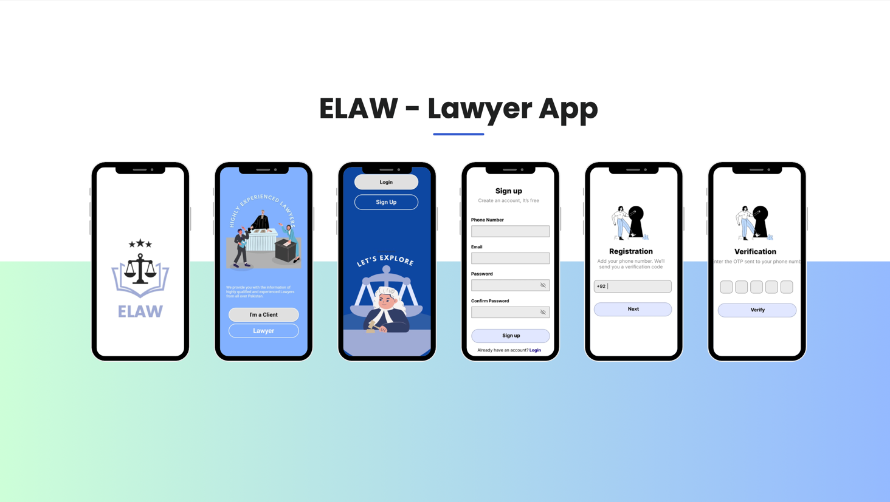
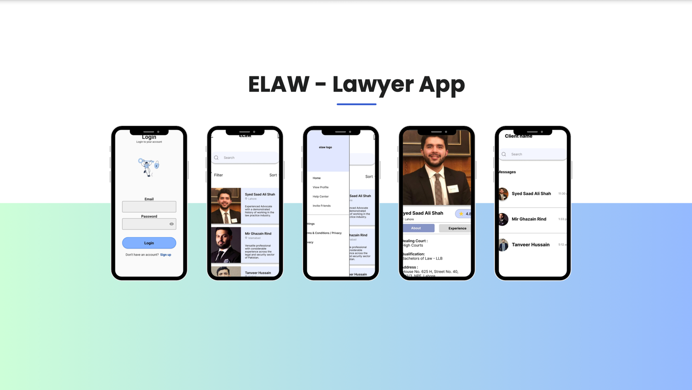

# ELaw App - README

## Overview

The **ELaw App** is a mobile application designed to streamline the process of connecting clients with lawyers within a law firm. This app ensures that users can easily search for and connect with appropriate legal professionals, providing a fast, efficient, and user-friendly experience. Developed using Flutter and designed with Figma, ELaw delivers a modern UI/UX and simplifies the client-lawyer connection process.

## Key Features

- **Intuitive User Interface**: The entire frontend was meticulously designed using Figma, focusing on creating a clean, user-friendly interface. The app ensures that clients can navigate seamlessly to find the right lawyer without unnecessary complexity.

- **Faster Client-Lawyer Connections**: The app optimizes the process of matching clients with the most suitable lawyers, reducing connection time by 75%. This feature allows for quick consultations and legal assistance with minimal delays.

- **Enhanced User Experience**: Implementing four critical modules has improved the overall user experience by 80%. The app design ensures that users can complete tasks efficiently, with minimal friction.

- **Reliable Lawyer Connectivity**: The app boasts a 90% success rate in connecting clients to the appropriate lawyers within the firm, ensuring reliable communication and consultations.

## Technology Stack

- **Flutter**: Used for building the mobile frontend, ensuring a smooth and consistent experience across both iOS and Android platforms.

- **Figma**: All UI/UX designs were created using Figma, ensuring a modern and visually appealing interface that prioritizes ease of use.

## Modules

1. **Lawyer Search**: Enables clients to quickly search for lawyers based on specific criteria like specialization, location, or availability.
2. **Profile Management**: Clients can create and manage their profiles to personalize their experience and save lawyer searches.
3. **Appointment Booking**: A streamlined module for booking consultations with lawyers directly through the app, ensuring quick scheduling.
4. **Real-Time Notifications**: Clients receive real-time updates on their appointments, messages, and lawyer availability, keeping them informed throughout the process.


## Screenshots





## Installation

To run the ELaw App on your local machine, follow these steps:

1. Clone the repository:
   ```bash
   git clone https://github.com/username/elaw-app.git
   ```
2. Install Flutter dependencies:
   ```bash
   flutter pub get
   ```
3. Run the app on your device/emulator:
   ```bash
   flutter run
   ```

## Future Enhancements

- **Lawyer Review System**: Enabling clients to rate and review their experiences with lawyers.
- **Multilingual Support**: Expanding language options to cater to a wider audience.
- **AI-based Lawyer Recommendation**: Integrating AI to provide personalized lawyer recommendations based on client needs.

---

This project was developed from October 2023 to December 2023, with the goal of modernizing the way clients connect with legal professionals.